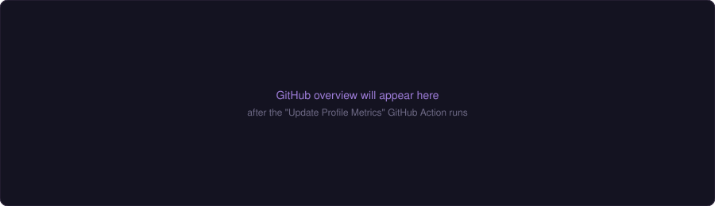
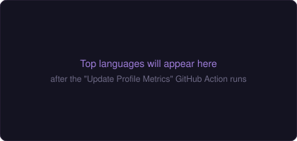
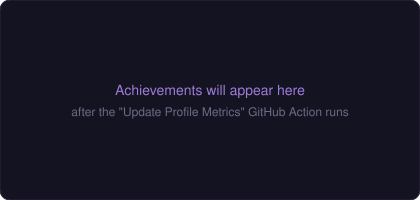

<h1 align="center">Hi 👋, I'm Arnab Kar</h1>
<h3 align="center">A Software Development Engineer II, Full Stack Developer From Kolkata, India.</h3>

  

- 🔭 I’m currently working on **Visa Inc.** as a Software Development Engineer II

- 🌱 I’m currently learning **Agentic AI Concepts**

- 💬 Ask me about **Python, Apache Spark, FastAPI, GenAI/LLM Integration, Distributed Systems, AWS, Azure, Kubernetes, Docker, PostgreSQL, MongoDB**

- 📫 How to reach me **arnab.kar101@gmail.com**

<h3 align="left">Connect with me:</h3>

<h3 align="left">Languages and Tools:</h3>

<h3 align="left">GitHub Overview:</h3>
<!-- Everything below is self-generated by .github/workflows/profile-metrics.yml (lowlighter/metrics), committed straight into assets/ — no third-party server rendering on page view. -->

  

  
  

  

